# Sustainer

## Table of contents

* [Overview](#overview)
* [Goals](#goals-of-the-app)
* [Application Design](#application-design)
    * [Data Model](#data-model)
    * [Flowchart](#application-flowchart)
* [Deployment](#deployment)
* [User Guide](#user-guide)
* [Team](#team)
* [Developer Guide](#developer-guide)
  * [Installation](#Installation)

## Overview

### What is Sustainer?
Sustainer is a reusable container tracking app that helps users and the non-profit Zero Waste O'ahu stay accountable for the return of reusable takeout containers at large events. The initial Full Cycle Takeout pilot program, responsible for creating and renting out reusable takeout containers, has already shown promise in reducing waste for restaurants, but has struggled with the return of the containers. This makes the program unsustainable financially and unsustainable for the planet. Failing to solve this problem leads to more one-time use products becoming trash and more reusable containers needing to be produced. Sustainer aims to solve this problem by providing a platform for Zero Waste O'ahu to track rented out containers and provide incentives for their return.

## Goals of the app

Our web app aims to provide the following features:

<li>Account registration</li>
<li>Reusable container ownership tracking</li>
<li>Ordering containers from vendors</li>
<li>Distributing containers to vendors from organization</li>
<li>Collateral payments if a container is not returned</li>
<li>QR code scanning and generation</li>
<li>Tracking of returned and non-returned containers</li>


## Application Design

The following describes the design process for our app:

### Data model

The data model for Sustainer consists of two "primary" collections (Accounts and Containers), along with one "join" Collections (ContainersByRole) and one supplemental collection (Credit Card).

We decided to present the model in this way to easily keep track of the ownership for each container. Here are some reasons for our design:
* The _role_ field has possibilities of user, vendor, or admin, which will indicate the navigation routes of UI pages upon log in. It will also be used to transfer ownership of a container from an admin (organization worker) to a vendor to a user (customer at the event).
* The CreditCard collection allows us to link a payment method as collateral for the containers that are ordered. In the scenario where they don't return the containers after the event is over, they will be charged accordingly.
* Multiple containers can be assigned to a single user. The ContainersByRole join collection help us to easily filter the number of containers by a specific user or owner when an admin/moderator wants to check which containers are available and returned.

Here is an example schematic of the database:

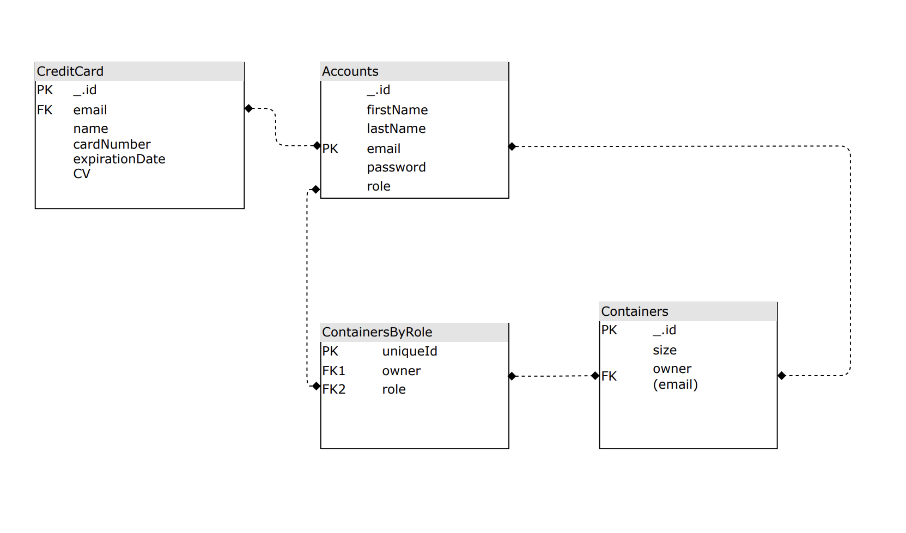

The fields labeled **PK** (Email for Accounts) indicate that this is a unique value so that they can be used as a primary key for that collection. This constraint is enforced in the schema definition associated with that collection. The label **FK** represents the foreign keys that are used from other collections.

### Application Flowchart

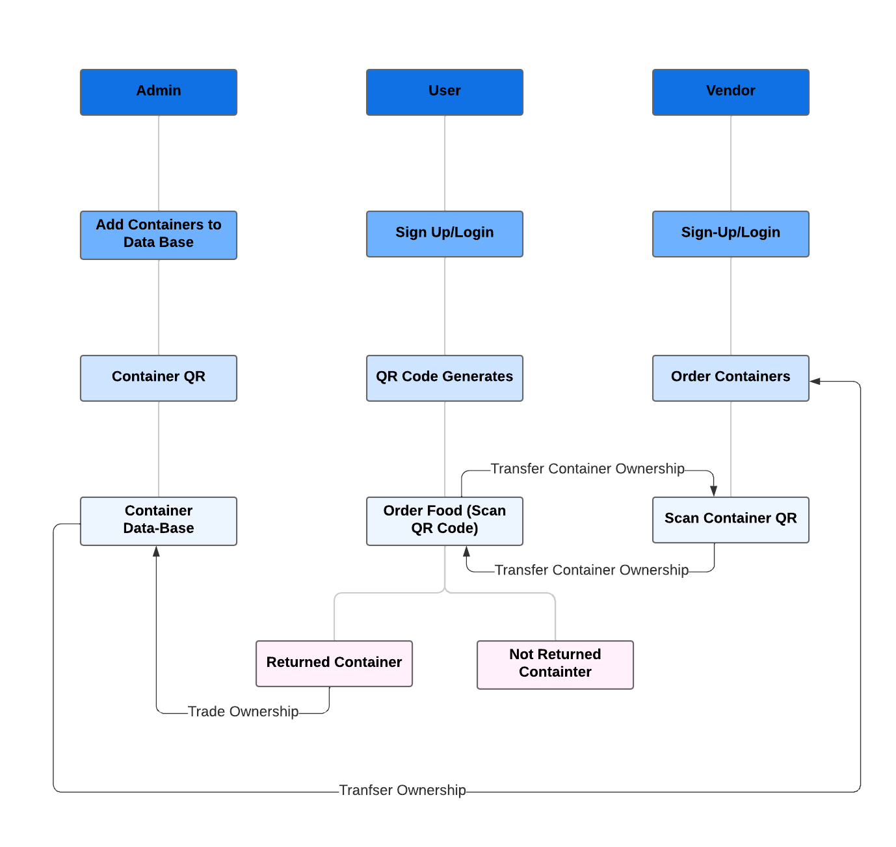

<br>

## Deployment

You can view our deployed app [**here**](https://sustainer.online): [https://sustainer.online](https://sustainer.online)

<br>

## User Guide

This section provides a walkthrough of the Sustainer web app including its user interface and its capabilities.

### Landing Page

The landing page is presented to users when they first visit the site. It provides a brief overview and purpose of the app.

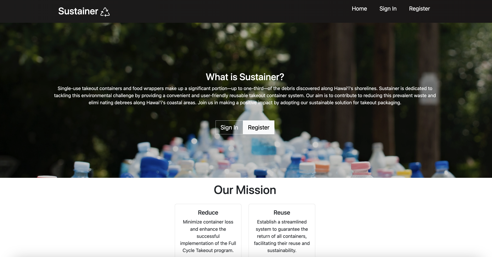

### User Registration Page

To order the reusable containers at events, users must sign up by clicking on the "Sign up" dropdown menu in the upper right corner of the navbar. This registers the user into a system at a certain event and generates a QR code to act as an "ID" for the event.

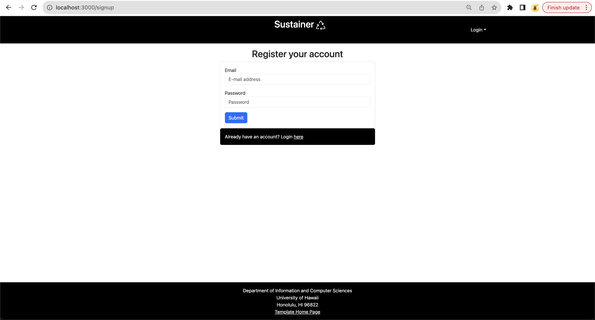

### Login Page

For returning users, click on the “Login” button in the dropdown located in upper right corner of the navbar, then select “Sign in” to go to get your newly-generated QR code for the event. You must have been previously registered with the system to use this option:

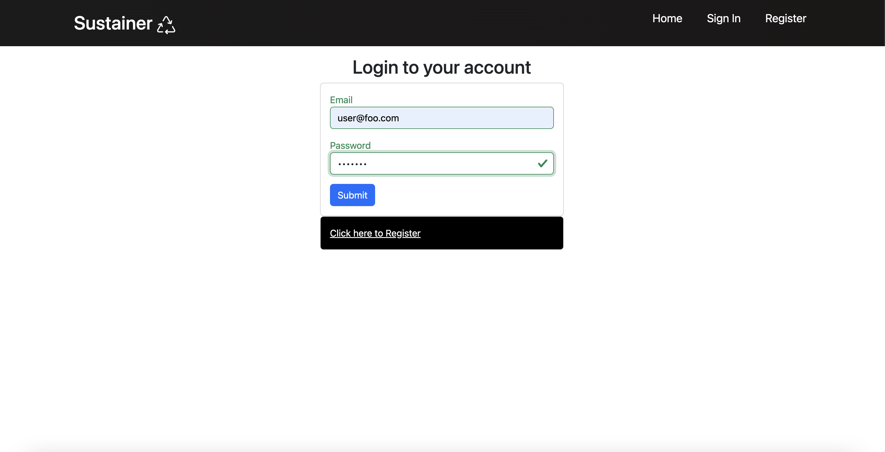

### User Home Page

After logging in, you are taken to the home page, which presents generic information on how to use the app. On this page, there are options to link your credit card information and get your QR code.

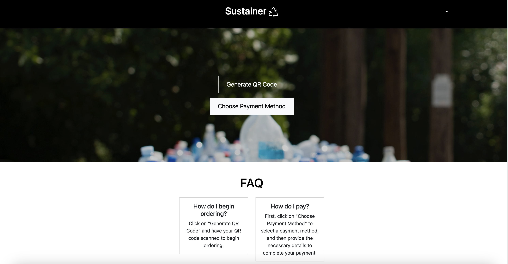

### QR Code Generator

Clicking on "Generate QR Code" will display the user's personal QR code. This will be used when the user orders food at the event. Customers will scan the QR at a food truck or vendor, which will "assign" those containers to them during the event. This helps admin keep track of the containers.

<p align="center">
    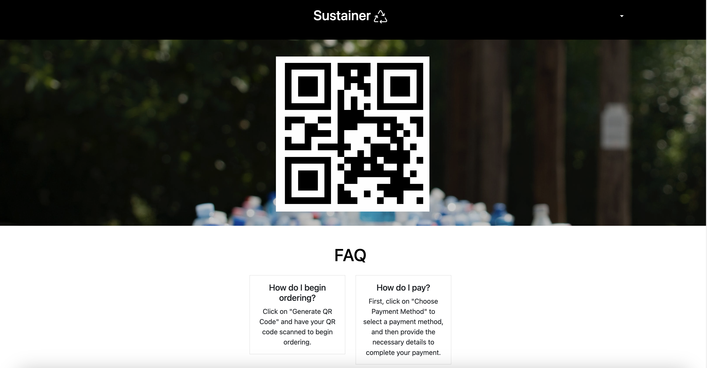
</p>

### Payment Portal

Clicking on "Choose Payment Method" will direct you to form where you can link and input your credit card information. Credit card information is used as collateral for any containers that are ordered and **not** returned within a specific limit or duration of the ongoing event. Upon ordering containers, there will be a pending charge based on the number of containers ordered, with each container charged at a flat rate. Payment will not be processed on your account if containers are returned before the end of the event.

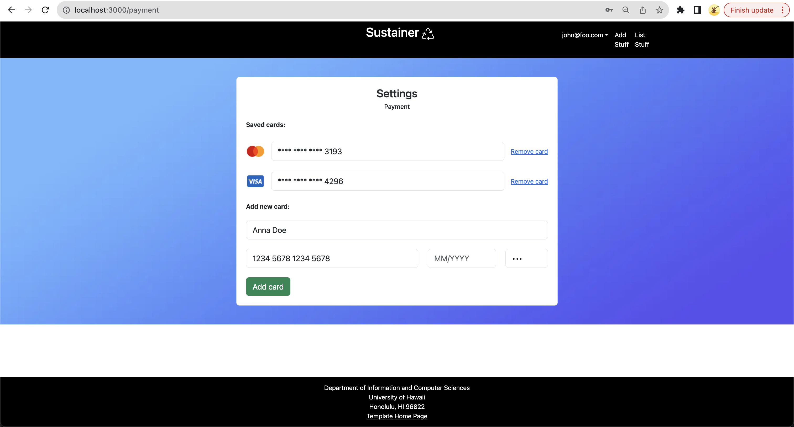

### Vendor Order Form

Upon log in as a vendor, a form is displayed to allow vendors to order a certain number of containers for an event. This allows the Full Cycle Takeout program to accurately distribute the right number of containers to each vendor before a customer uses them when ordering take-out at the event.

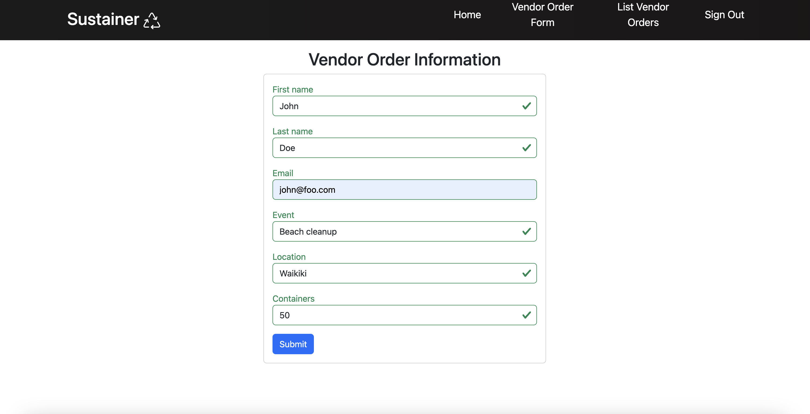

### Vendor Order History Page

Clicking on the "List Vendor Orders" nav link will show a history list of order forms that a vendor has filled out for all previous and upcoming events. Vendors will be able to edit current pending forms for an event that hasn't passed. They can also delete forms from their history.

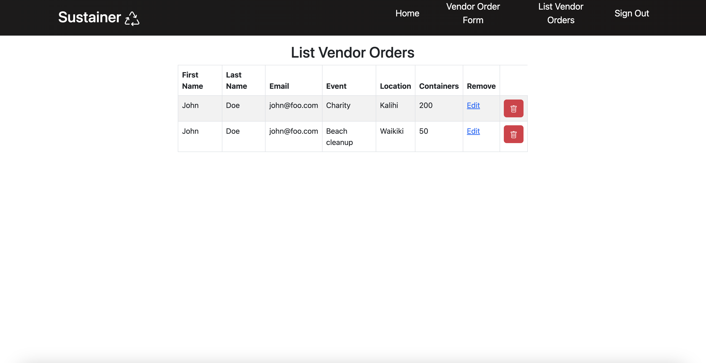

### Scan QR Code Page

After an event is over, moderators (workers) and administrators of the organization can use this page to scan QR codes on the containers and check them back in. This confirms that the user/consumer has returned all of their "assigned" containers from the event. Proper authorized accounts can only access this page by clicking on the "Scan Containers" nav link upon signing in.

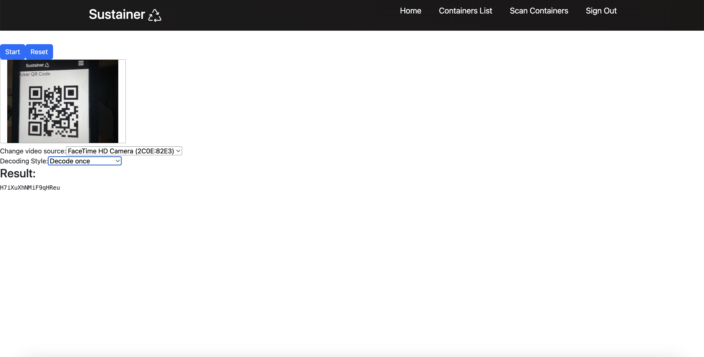

### Admin Stats Page
Upon log in as an admin, moderators and administrators can view all containers during an event to accurately track them. This will display all the available containers, as well as the owner that is assigned or responsible for a specific container. The database table UI will also have a search and filter function to find a certain container and check if a specific user has returned their containers respectively.

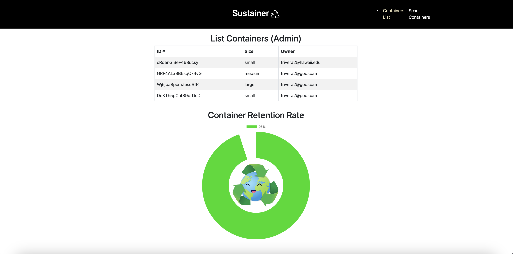

There is also a percentage graphic to show the retention rate of the containers. The pie chart will update in real-time when containers are taken out and returned by customers at the event. An environmental graphic will also correspond with the percentage of the containers that are returned. This will indicate the effectiveness of the take-out and return procedure at events, while also evaluating the "efficiency" of this app's functionality.

<div class="justify-content-center text-center p-4" style="padding-top: 5px; padding-bottom: 5px">
  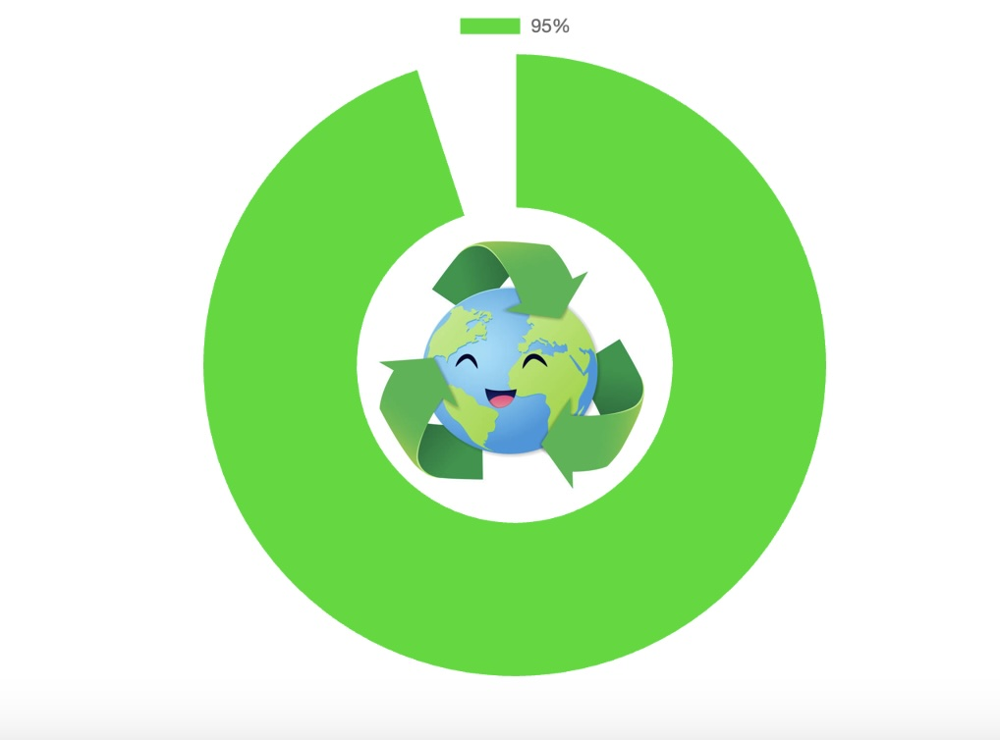
  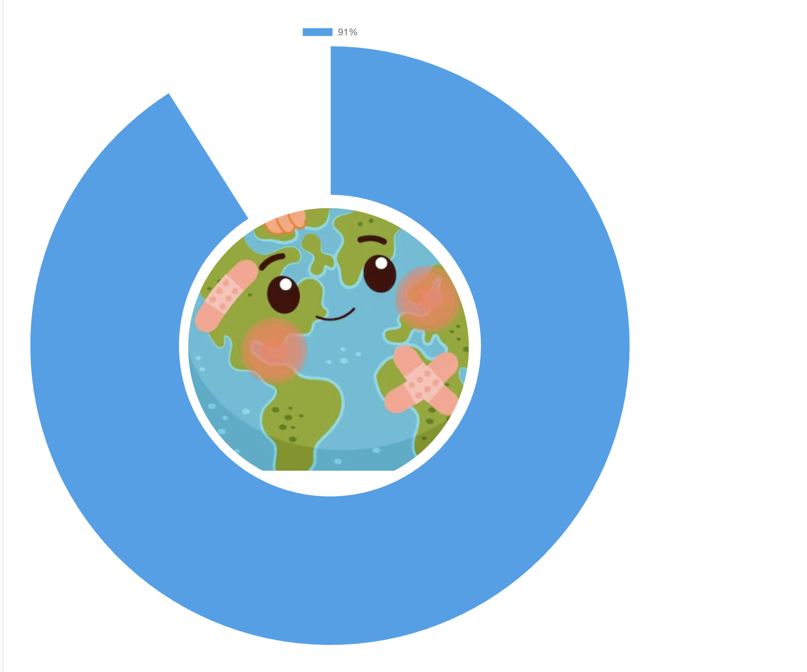
</div>

<div class="justify-content-center text-center p-4" style="padding-top: 5px; padding-bottom: 50px">
  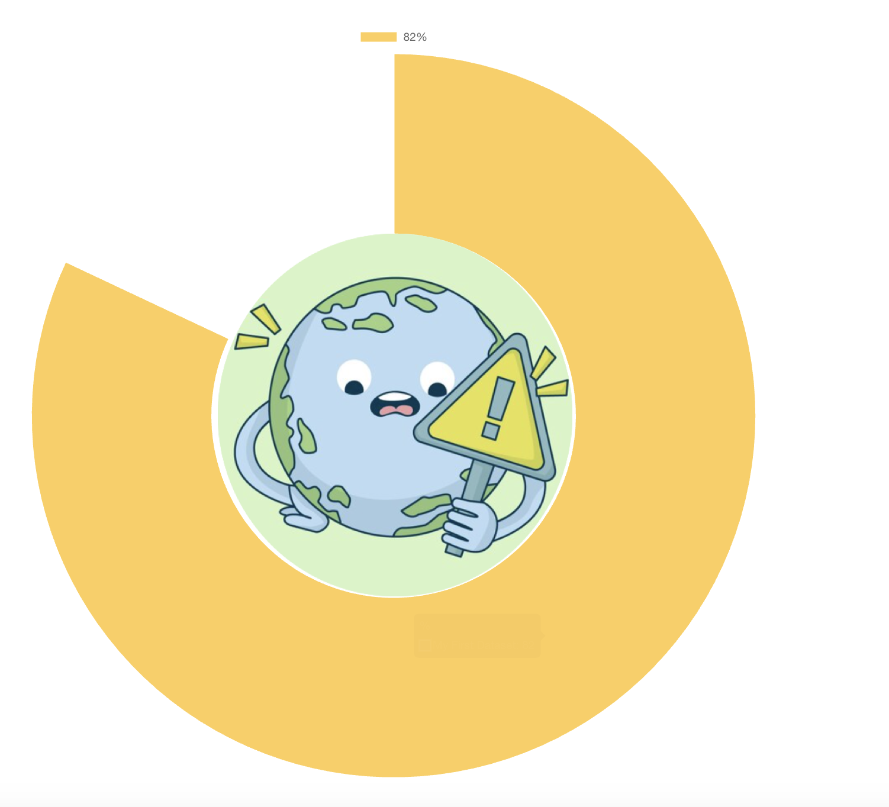
  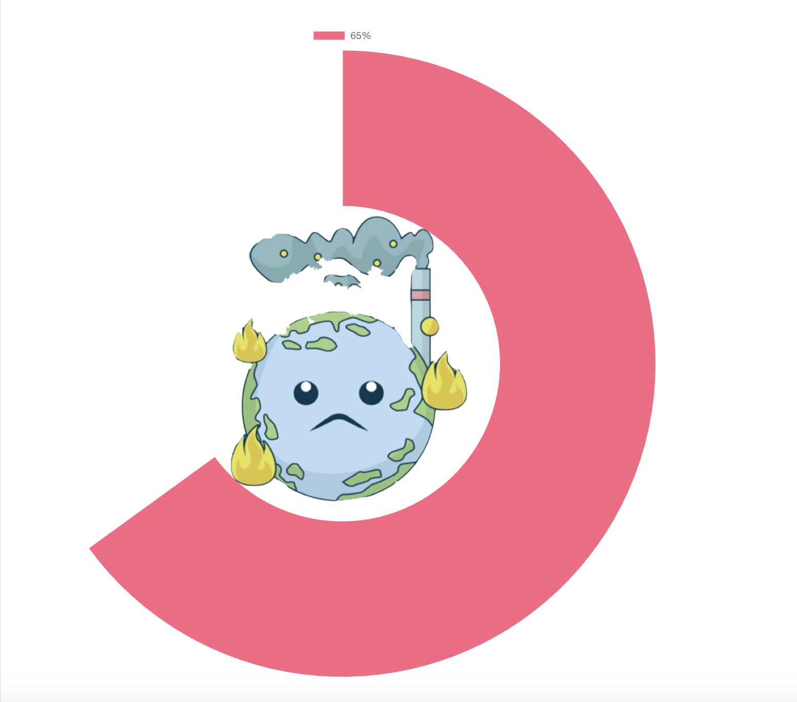
</div>

<br>

## Team BitByBit

Sustainer is designed and developed by:
* [**Aaron Lander Ancheta**](https://github.com/aaron-ancheta) || [View Portfolio](https://aaron-ancheta.github.io/)
* [**Nathaniel Murray**](https://github.com/murrayn808) || [View Portfolio](https://murrayn808.github.io/)
* [**Jaren Pinera**](https://github.com/jpinera) || [View Portfolio](https://jpinera.github.io/)
* [**Thomas Rivera**](https://github.com/thomasarivera) || [View Portfolio](https://thomasarivera.github.io/)
* [**Sage Suzuki**](https://github.com/sage-suzuki) || [View Portfolio](https://sage-suzuki.github.io/)


## Developer Guide

This section provides information of interest to Meteor developers wishing to use this code base as a basis for their own development tasks.

### Installation

First, [install Meteor](https://www.meteor.com/install).

Second, visit the [Sustainer application GitHub page](https://github.com/HACC2023/BitByBit), and click the "Use this template" button to create your own repository initialized with a copy of this application. Alternatively, you can download the sources as a zip file or make a fork of the repo.  However you do it, download a copy of the repo to your local computer.

Third, cd into the BitByBit/app directory and install libraries with:

```
$ meteor npm install
```

Fourth, run the system with:

```
$ meteor npm run start
```

If all goes well, the application will appear at [http://localhost:3000](http://localhost:3000).


<!--
## Community Feedback

**_In progress_**

We are interested in your experience using Sustainer! A form will soon be created to list any suggestions on improving the app.


## Deployment

**_Our app deployment is in progress_**


## Initialization

The [config](https://github.com/bowfolios/bowfolios/tree/main/config) directory is intended to hold settings files.  The repository contains one file: [config/settings.development.json](https://github.com/bowfolios/bowfolios/blob/main/config/settings.development.json).

This file contains default definitions for Profiles, Projects, and Interests and the relationships between them. Consult the walkthrough video for more details.

The settings.development.json file contains a field called "loadAssetsFile". It is set to false, but if you change it to true, then the data in the file app/private/data.json will also be loaded.  The code to do this illustrates how to initialize a system when the initial data exceeds the size limitations for the settings file.


### Quality Assurance

#### ESLint

BowFolios includes a [.eslintrc](https://github.com/bowfolios/bowfolios/blob/main/app/.eslintrc) file to define the coding style adhered to in this application. You can invoke ESLint from the command line as follows:

```
meteor npm run lint
```

Here is sample output indicating that no ESLint errors were detected:

```
$ meteor npm run lint

> bowfolios@ lint /Users/philipjohnson/github/bowfolios/bowfolios/app
> eslint --quiet --ext .jsx --ext .js ./imports ./tests

$
```

ESLint should run without generating any errors.

It's significantly easier to do development with ESLint integrated directly into your IDE (such as IntelliJ).

#### End to End Testing

BowFolios uses [TestCafe](https://devexpress.github.io/testcafe/) to provide automated end-to-end testing.

The BowFolios end-to-end test code employs the page object model design pattern.  In the [bowfolios tests/ directory](https://github.com/bowfolios/bowfolios/tree/main/app/tests), the file [tests.testcafe.js](https://github.com/bowfolios/bowfolios/blob/main/app/tests/tests.testcafe.js) contains the TestCafe test definitions. The remaining files in the directory contain "page object models" for the various pages in the system (i.e. Home, Landing, Interests, etc.) as well as one component (navbar). This organization makes the test code shorter, easier to understand, and easier to debug.

To run the end-to-end tests in development mode, you must first start up a BowFolios instance by invoking `meteor npm run start` in one console window.

Then, in another console window, start up the end-to-end tests with:

```
meteor npm run testcafe
```

You will see browser windows appear and disappear as the tests run.  If the tests finish successfully, you should see the following in your second console window:

```
$ meteor npm run testcafe

> bowfolios@ testcafe /Users/philipjohnson/github/bowfolios/bowfolios/app
> testcafe chrome tests/*.testcafe.js

 Running tests in:
 - Chrome 86.0.4240.111 / macOS 10.15.7

 Bowfolios localhost test with default db
 ✓ Test that landing page shows up
 ✓ Test that signin and signout work
 ✓ Test that signup page, then logout works
 ✓ Test that profiles page displays
 ✓ Test that interests page displays
 ✓ Test that projects page displays
 ✓ Test that home page display and profile modification works
 ✓ Test that addProject page works
 ✓ Test that filter page works


 9 passed (40s)

 $
```

You can also run the testcafe tests in "continuous integration mode".  This mode is appropriate when you want to run the tests using a continuous integration service like Jenkins, Semaphore, CircleCI, etc.  In this case, it is problematic to already have the server running in a separate console, and you cannot have the browser window appear and disappear.

To run the testcafe tests in continuous integration mode, first ensure that BowFolios is not running in any console.

Then, invoke `meteor npm run testcafe-ci`.  You will not see any windows appear.  When the tests finish, the console should look like this:

```
$ meteor npm run testcafe-ci

> bowfolios@ testcafe-ci /Users/philipjohnson/github/bowfolios/bowfolios/app
> testcafe chrome:headless tests/*.testcafe.js -q --app "meteor npm run start"

 Running tests in:
 - Chrome 86.0.4240.111 / macOS 10.15.7

 Bowfolios localhost test with default db
 ✓ Test that landing page shows up (unstable)
 ✓ Test that signin and signout work
 ✓ Test that signup page, then logout works
 ✓ Test that profiles page displays
 ✓ Test that interests page displays
 ✓ Test that projects page displays
 ✓ Test that home page display and profile modification works
 ✓ Test that addProject page works
 ✓ Test that filter page works


 9 passed (56s)

$
```

All the tests pass, but the first test is marked as "unstable". At the time of writing, TestCafe fails the first time it tries to run a test in this mode, but subsequent attempts run normally. To prevent the test run from failing due to this problem with TestCafe, we enable [testcafe quarantine mode](https://devexpress.github.io/testcafe/documentation/guides/basic-guides/run-tests.html#quarantine-mode).

The only impact of quarantine mode should be that the first test is marked as "unstable".

## From mockup to production

Bowfolios is meant to illustrate the use of Meteor for developing an initial proof-of-concept prototype.  For a production application, several additional security-related changes must be implemented:

* Use of email-based password specification for users, and/or use of an alternative authentication mechanism.
* Use of https so that passwords are sent in encrypted format.
* Removal of the insecure package, and the addition of Meteor Methods to replace client-side DB updates.

(Note that these changes do not need to be implemented for ICS 314, although they are relatively straightforward to accomplish.)

## Continuous Integration


BowFolios uses [GitHub Actions](https://docs.github.com/en/free-pro-team@latest/actions) to automatically run ESLint and TestCafe each time a commit is made to the default branch.  You can see the results of all recent "workflows" at [https://github.com/bowfolios/bowfolios/actions](https://github.com/bowfolios/bowfolios/actions).

The workflow definition file is quite simple and is located at
[.github/workflows/ci.yml](https://github.com/bowfolios/bowfolios/blob/main/.github/workflows/ci.yml).

* [Continuous Integration](#continuous-integration)
* [Walkthrough videos](#walkthrough-videos)
* [Example enhancements](#example-enhancements)


* [Meteor](https://www.meteor.com/) for Javascript-based implementation of client and server code.
* [React](https://reactjs.org/) for component-based UI implementation and routing.
* [React Bootstrap](https://react-bootstrap.github.io/) CSS Framework for UI design.
* [Uniforms](https://uniforms.tools/) for React and Semantic UI-based form design and display.

It also provides code that implements a variety of useful design concepts, including:

* Three primary collections (Profiles, Projects, Interests) as well as three "join" Collections (ProfilesInterests, ProfilesProjects, and ProjectsInterests) that implement many-to-many relationships between them.
* Top-level index pages (Profiles, Interests, and Projects) that show how to manipulate these six collections in various ways.
* Initialization code to define default Profiles, Interests, and Projects and relations between them.
* A simple Filter page to illustrate how to perform simple queries on the database and display the results.
* Use of Meteor Methods to illustrate how to simplify implementation of multiple collection updates.
* Use of indexes to enforce uniqueness of certain fields in the collections, enabling them to serve as primary keys.
* Authentication using the built-in Meteor accounts package along with Sign Up and Sign In pages.
* Authorization examples: certain pages are public (Profiles, Projects, Interests), while other pages require login (AddProject, Filter).
* Use of Meteor Assets to initialize the database (helpful when initialization exceeds settings file size limits).
-->

<!--
## Milestone 3: 

The goal of Milestone 3 was to clean up the code base and fix minor UI issues.

Milestone 3 was managed using [BowFolio GitHub Project Board M3](https://github.com/bowfolios/bowfolios/projects/3):


As of the time of writing, this screenshot shows that there is an ongoing task (i.e. this writing).

Need to do:
1. M1 and M2 project fix w/ issues, then right screenshot (check if correct)
5. Copy all contents to repo and name issue branches accordingly
6. Pitch
8. (Make team logo)
-->
